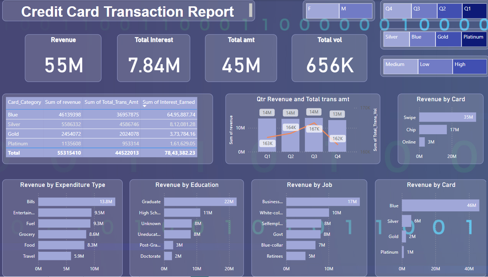

# Credit Card Transaction Report — Power BI Dashboard

This project showcases a Power BI dashboard designed to analyze **credit card transaction data** for a financial institution. The dashboard delivers actionable insights into customer spending behavior, card performance, and transaction trends, helping businesses make informed strategic decisions.

---

## **Objective**

The goal of this dashboard is to provide clear, data-driven insights into:

- Total Revenue and Interest Earned from credit card usage.
- Customer behavior segmented by **Card Category**, **Expenditure Type**, **Job Role**, and **Education Level**.
- Quarterly revenue trends and transaction volumes.
- Identification of the most and least profitable card categories.

---

## **Dashboard Highlights**

---

### **Key Insights**

- **Total Revenue Generated:** 55M  
- **Total Interest Earned:** 7.84M  
- **Total Transaction Amount:** 45M  
- **Total Transaction Volume:** 656K  

---

### **Visual Breakdown**

-  **KPI Cards**: At-a-glance view of major financial metrics.
-  **Category Tables**: Revenue, Total Transaction Amount, and Interest Earned by card type (Blue, Silver, Gold, Platinum).
-  **Quarterly Analysis**: Bar & line combo chart for revenue and transaction volumes (Q1 - Q4).
-  **Revenue by Card Type**: Swipe, Chip, Online.
-  **Revenue by Expenditure Type**: Bills, Entertainment, Fuel, Grocery, Food, Travel.
-  **Revenue by Education Level**.
-  **Revenue by Job Category**.

---

## 🧠 **Business Value**

This dashboard helps financial institutions:

- Identify high-value card categories.
- Monitor transaction patterns over time.
- Understand customer profiles for better targeted marketing.
- Support data-backed decision-making for product strategies.

---
